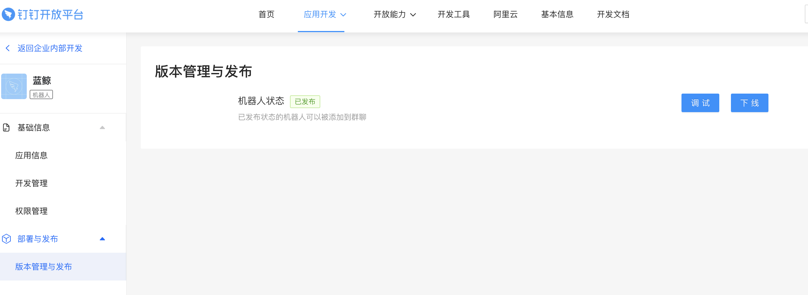
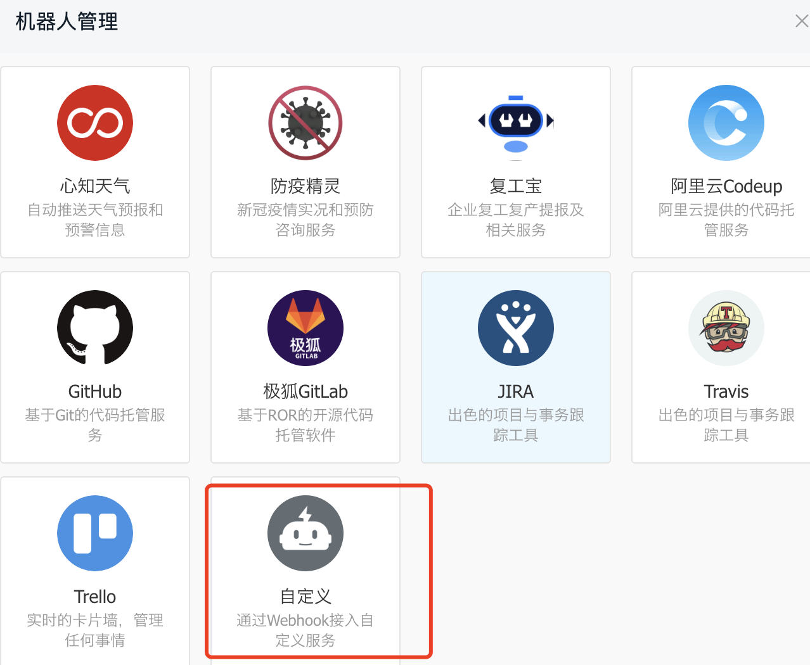
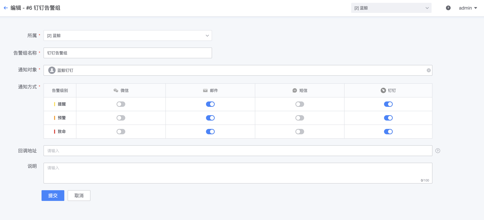

# 钉钉通知接入和使用

钉钉通知渠道可以为**蓝鲸**增加钉钉消息通知方式，可以实现蓝鲸消息单发、消息群发功能

## 部署

**注意：**仅在paas 2.12.25版本测试过，paas版本通过中控机执行`cat /data/src/open_paas/VERSION`可以查看

1. 下载release包，上传到paas机器上的`/data`路径下，release包下载地址: https://github.com/wenchao-h/ding-blueking/releases

2. 备份paas机器上的`/data/bkce/open_paas/esb/components/generic/apis`，将release包解压到`/data/bkce/open_paas/esb/components/generic/apis`下

   ```
   # paas机器上执行
   mkdir -p /data/backup
   cp -r /data/bkce/open_paas/esb/components/generic/apis /data/backup
   tar -xf /data/ding-blueking-x.x.x.tgz -C /data/bkce/open_paas/esb/components/generic/apis/
   ```

3. 将钉钉接口注册到数据库

```
# 设置环境变量
source /root/.bkrc
source $CTRL_DIR/functions
export BK_ENV=production
export BK_FILE_PATH=/data/bkce/open_paas/cert/saas_priv.txt
export PAAS_LOGGING_DIR=/data/bkce/logs/open_paas

workon open_paas-esb
python manage.py sync_system_and_channel_data

# 重启esb
systemctl restart bk-paas-esb.service
```

## 消息单发

### 接入步骤

钉钉通知渠道支持将蓝鲸平台的消息通过「**企业内部机器人**」发送到个人，适用场景：监控告警消息、作业平台作业执行状态消息、标准运维执行状态消息、流程服务提单消息。

要实现该功能，对用户管理信息、企业内部钉钉机器人权限有要求：

1. 用户在用户管理的手机号需和用户在钉钉注册的**手机号一致**，通知渠道会通过该手机号确定目标用户
2. 用户需创建企业内部机器人，并授予权限
4. 发布企业内部机器人
4. 将企业内部机器人的appkey和appsecret填写到通道管理「发送钉钉单聊消息」接口配置里

### 创建内部机器人

创建企业内部机器人步骤：

1. 以管理员账号登录钉钉开放平台，选择「应用」-「企业内部应用」


2. 授予机器人权限

「权限管理」-「申请`根据手机号姓名获取成员信息的接口访问权限`以及`企业内机器人发送消息权限`」


3. 发布机器人

「版本管理与发布」-「上线」




4. 创建机器人，以admin身份登录蓝鲸，在「开发者中心」-「通道管理」填写机器人的appkey和appsecret信息


钉钉接口参考文档：https://open.dingtalk.com/document/group/chatbots-send-one-on-one-chat-messages-in-batches


## 消息群发

### 接入步骤

钉钉通知渠道支持将蓝鲸平台的消息通过「自定义机器人」发送到群，适用场景：不同业务的告警消息发送到不同的群

要实现该功能，需要：

1. 创建群以及自定义机器人
2. 提供机器人的签名和webhook
3. 在用户管理创建机器人用户

**注意：** 自定义机器人是群独有的，无法跨群提供服务，如果有多个群，需要创建多个机器人用户

钉钉接口参考：https://open.dingtalk.com/document/group/custom-robot-access

### 创建群机器人

「设置」-「智能群助手」-「添加机器人」-「添加自定义机器人」-「选择加签」-「记录签名串」-「记录webhook地址」-「添加成功」





**记录下签名和webhook地址，后续步骤需要使用**


添加成功


### 创建蓝鲸机器人用户

在用户管理创建机器人用户

1. 用户名和全名建议填写可识别名称，有多个业务群，建议按照业务名称区分群机器人，如王者荣耀机器人
2. 邮箱和手机号随便填写，符合要求即可
3. 微信字段填写机器人的签名字符串，签名字符串为SEC开头的随机串
4. qq字段填写webhook地址里的access_token，比如机器人的webhook地址是`https://oapi.dingtalk.com/robot/send?access_token=e0153628fcxxxxx`，则qq字段就是`e0153628fcxxxxx`


## 使用

不管是群发消息还是单聊消息，使用方法都是一样的，蓝鲸会自动识别机器人用户和普通用户，如果是消息接收人配置了机器人用户，则消息会通过机器人发送到群，如果消息接收人配置为普通用户，消息会发送到个人单聊窗口。

### 监控平台配置钉钉

1. 启用钉钉通知方式：「全局配置」-「勾选钉钉」
2. 在告警组里启用钉钉通知方式，并配置通知对象为普通用户或者机器人用户





### 作业平台配置钉钉

1. 作业平台全局配置，启用钉钉
2. 配置模板，可直接保存默认模板
3. 消息通知里选择场景启用钉钉，配置接收人


### 标准运维配置钉钉

标准运维可以根据业务需要选择以下场景：

1. 在标准运维步骤里使用：蓝鲸服务-「发送通知」插件
2. 在标准运维项目里使用：项目基础信息-勾选钉钉


### 流程服务配置钉钉

1. 配置通知模板
2. 在流程高级配置里选择钉钉通知


### 发送效果

**群机器人人效果：**


**单聊消息发送效果：**


